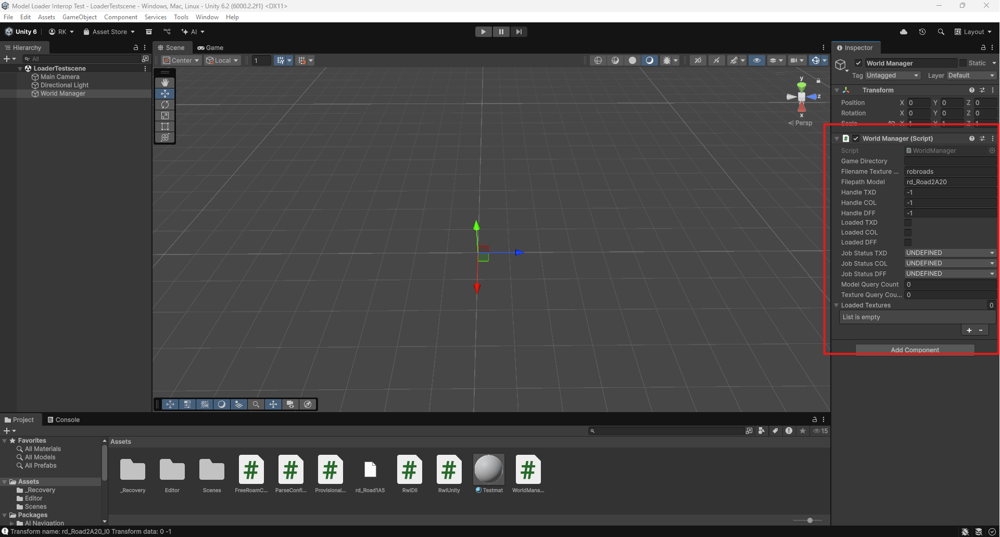
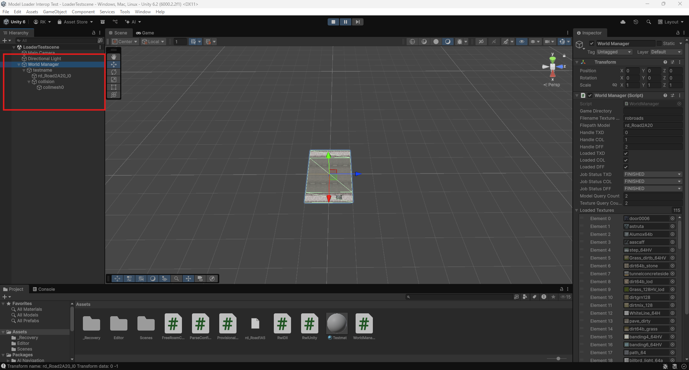
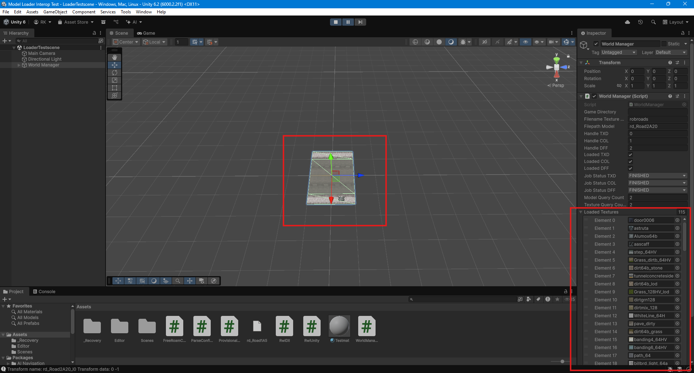
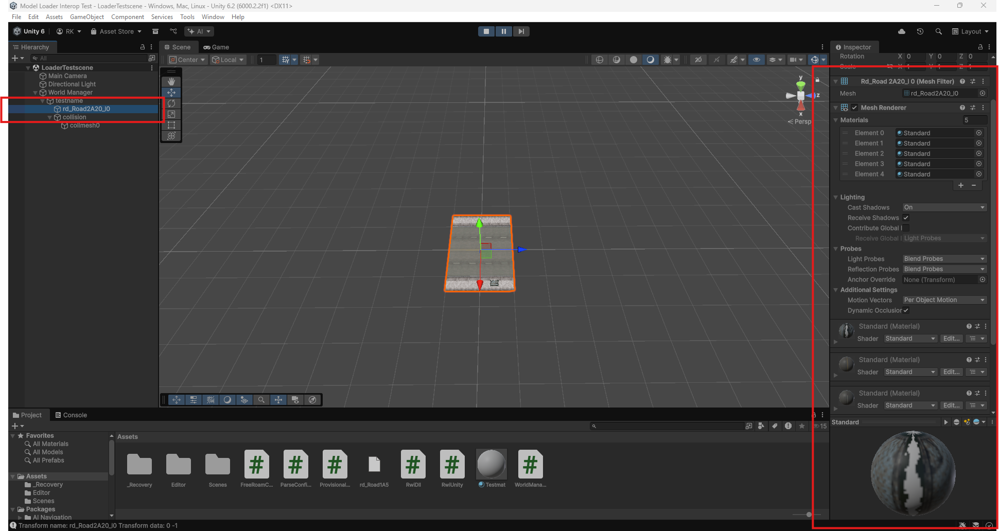
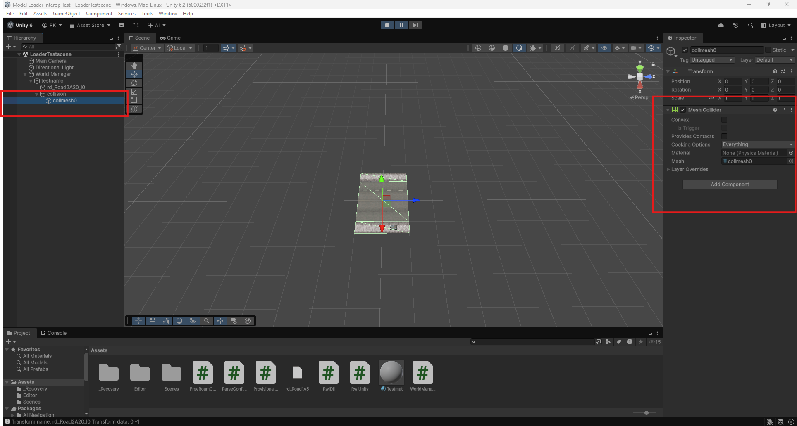

# RwiUnity
The C#/Unity scripting side of the RWImport library. Includes a sample loader to get something viewable quickly. 

The actual "heart" of this code are the static RwiDll class, which implements the actual managed/native interface and the static RwiUnity class, 
which implements methods that turn the marshalled data into actually usable Unity objects.

The WorldManager script can be thought of as a quick template script to get the loader running with *something*. 
You *will* have to modify to get it running yourself as I do not supply any game data and some of the filepaths 
that it uses are not publicly exposed. At this point I do not see this as a problem though as it is very much an 
experimental proof of concept to show that the DLL and the managed/native interface are actually working as intended. 

# Showcase
These are some screenshots from within the Unity Editor that show a paused game loop after an object has been loaded.

- Before the load - the WorldManager script/component interface:
  

- This sample script creates a load job and polls the interface every frame for the result. As soon as the load job is finished, the data is 
  copied.

- The WorldManager script instantiates the model as a child GameObject that mirror's the DFF's scene graph + a collision model:
  

- The single TXD that this script loads can be inspected for its constituent textures:
  

- Instantiation from an Instantiation Tree creates a full per object scene graph that can be requested trimmed (i.e empty nodes removed).
  In this particular case, the loaded model only has one mesh. Each mesh is instantiated as a game object containing a mesh filter and a mesh
  renderer:
  

- Because Unity's collider system is somewhat different from GTA's, each collider primitive (boxes and spheres) is instantiated as its own
  child GameObject as well as one mesh collider per collision material in its own child GameObject since Unity does not support mesh
  colliders that have more than one physics material:
  

